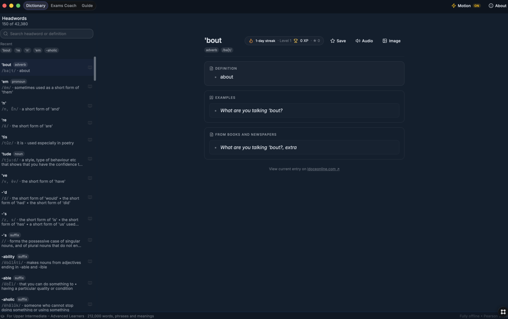
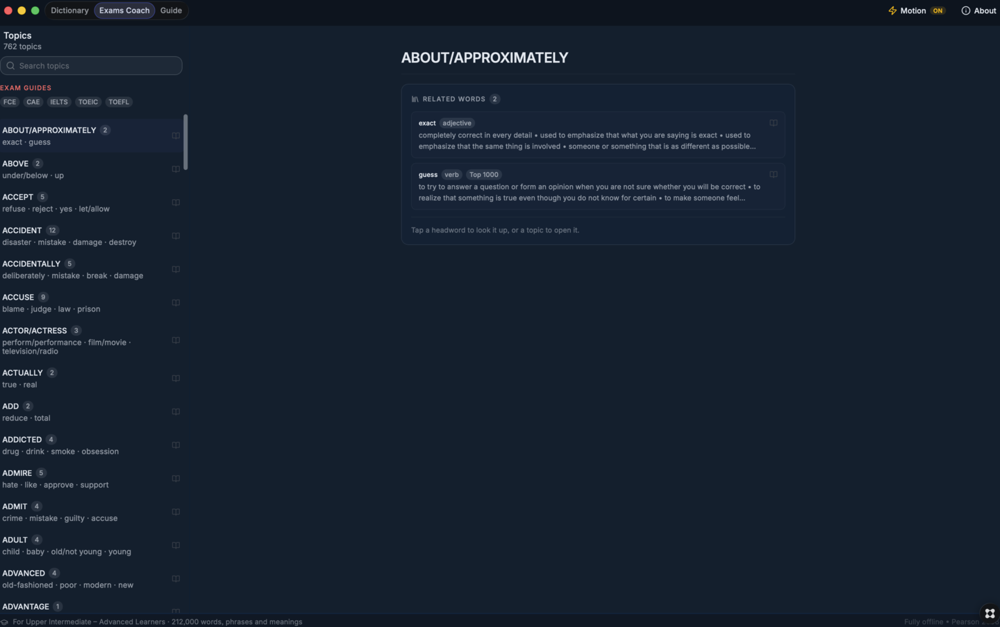
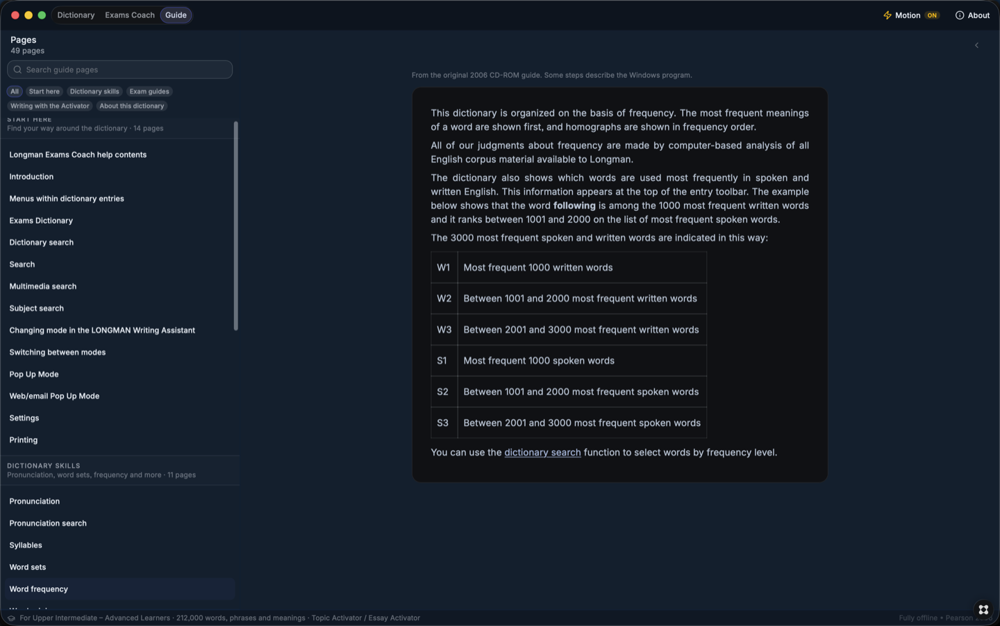

# Longman Exams Dictionary


Unofficial native macOS port of the classic **Longman Exams Dictionary CD-ROM (2006)**, built for upper-intermediate to advanced learners preparing for FCE, CAE, IELTS, TOEIC and TOEFL. Fully offline, no account, no tracking. Live on the [Glaze Store](https://www.glaze.app/) by Raycast.

## Screenshots

| Dictionary | Exams Coach | Guide |
|---|---|---|
|  |  |  |

## Features

- **Dictionary** — 42,380 headwords with pronunciations, verb forms, collocations and corpus examples; Top 1000 exam-priority markers; debounced instant search with A–Z paging
- **Exams Coach** — 762 exam topics with related-word glosses, exam-guide chips and study streaks with XP
- **Guide** — the full 49-page study handbook as five readable journeys (dictionary skills, exam formats, academic writing)
- **Common mistakes** — wrong vs right minimal pairs with plain explanations and tappable cross-reference jumps
- **Fully offline** — SQLite corpus, pronunciation audio and illustrations all on-device; light and dark mode

## Tech stack

| Layer | Choice |
|---|---|
| App shell | Glaze 0.14 (native macOS, Apple Silicon) |
| Renderer | React 19 + TypeScript 5.5, Tailwind v4 |
| Data | SQLite (FTS5 search) via Git LFS, JSON fallback |
| Search | Exact + prefix + inflection + BM25 fallback, 150ms debounce |
| Media | CD pronunciation audio, 1,352 illustrations |

## Project structure

```
sources/
├── main/handlers/dictionary.ts  # SQLite + search + help backend
├── renderer/main/home-view.tsx  # all three tabs
├── renderer/styles.css          # Pearson/Longman brand theme
├── data/led_full.sqlite         # recovered corpus (Git LFS)
├── data/help/*.htm              # 49 guide pages
└── data/images/ data/audio/     # illustrations + pronunciation
```

## Setup

```bash
git lfs pull            # fetch the 350MB corpus
npm install
bash glaze-node.sh build
bash glaze-node.sh repackage
```

## CI

Hosted CI (`verify`) runs on every push: install, 11 repo invariants,
full `tsc` against committed SDK type stubs, and esbuild bundle-ability
for both processes. The Glaze linker exists only inside the desktop app,
so native builds stay local — or opt in: install a self-hosted runner on
your Mac (any Apple Silicon runner matches), set repo variable
`MAC_RUNNER=true`, and `verify-native` runs the real `glaze-node.sh verify` there.

## Data provenance

Corpus recovered from a retail Longman Exams Dictionary CD-ROM (Pearson Longman, 2006) for preservation and personal study. Unofficial community port — not affiliated with or endorsed by Pearson. Distributed here for archival purposes; if you own the rights and object, open an issue.

## License

Code: MIT. Corpus and Longman content remain the property of their respective owners.
