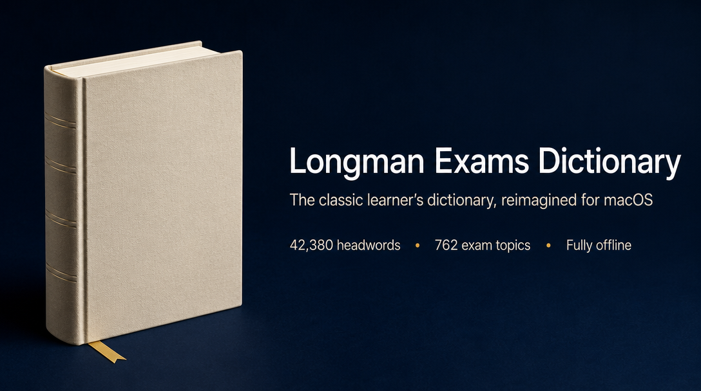
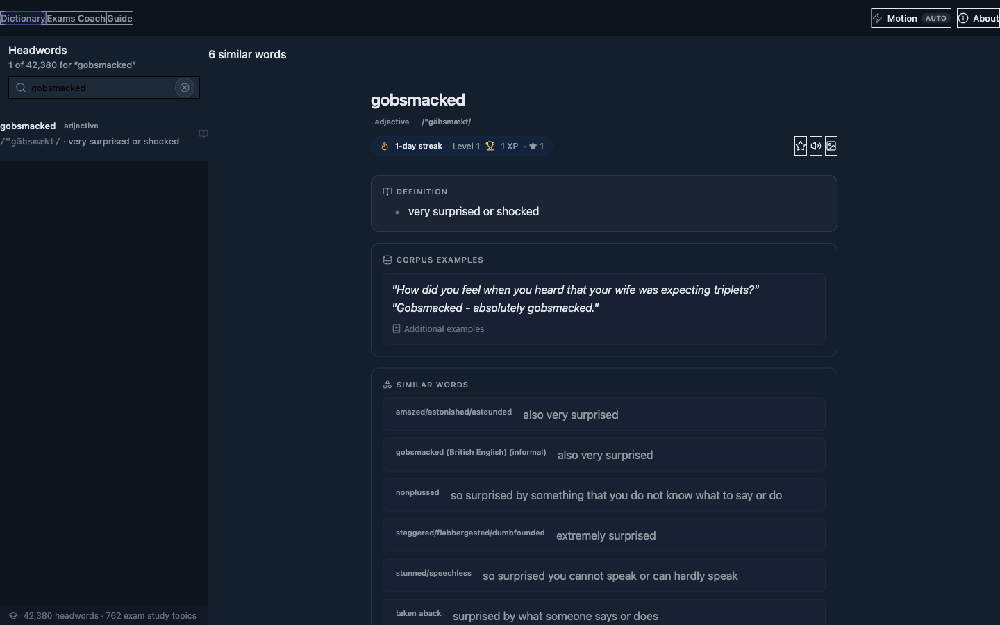
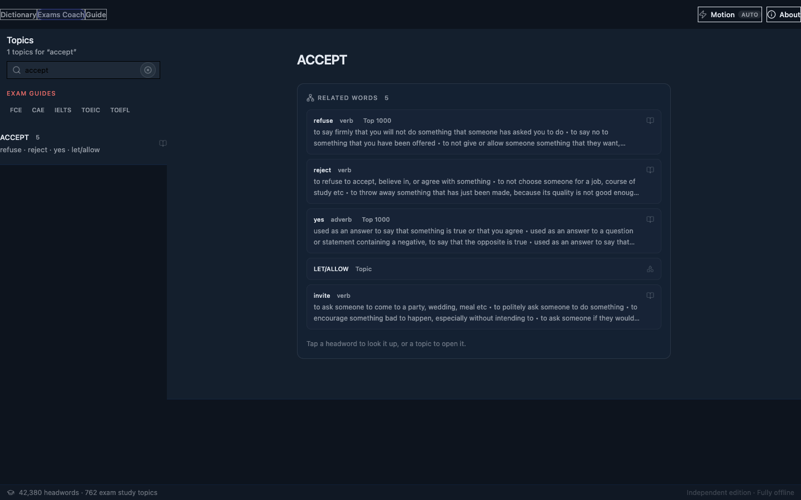
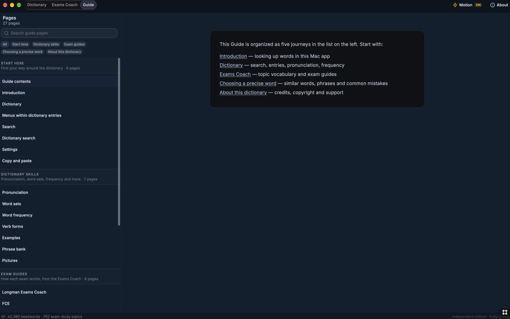
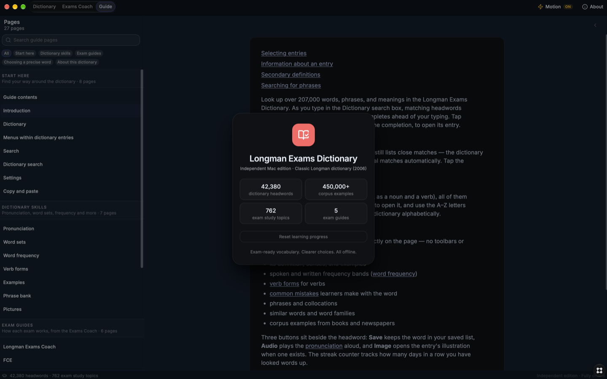

# Longman Exams Dictionary

<p align="center">
  
</p>

<p align="center">
  
  
  
  
  
  
  
  <a href="https://github.com/Mihai-Codes/longman-exams-dictionary/actions/workflows/verify.yml"></a>
</p>

Unofficial native macOS port of the classic **Longman Exams Dictionary CD-ROM (2006)**, built for upper-intermediate to advanced learners preparing for FCE, CAE, IELTS, TOEIC and TOEFL. Fully offline, no account, no tracking. Live on the [Glaze Store](https://www.glaze.app/) by Raycast.

## Screenshots

| Dictionary · gobsmacked | Exams Coach · ACCEPT |
|---|---|
|  |  |

| Guide · Word frequency | About |
|---|---|
|  |  |

## Features

- **Dictionary** — 42,380 headwords with pronunciations, verb forms, collocations and corpus examples; Top 1000 exam-priority markers plus Longman Communication 3000 frequency bands (S1–S3 spoken, W1–W3 written); debounced instant search with A–Z paging
- **Exams Coach** — 762 exam topics with related-word glosses, exam-guide chips and study streaks with XP
- **Guide** — the study handbook as five readable journeys (start here, dictionary skills, exam guides, choosing a precise word, about), with accessible tables
- **Compact windows** — Dictionary, Exams Coach and Guide switch to full-width list/detail navigation below 640px; desktop split views remain unchanged
- **Clearer entries** — long headwords wrap cleanly and repeated verb forms are grouped
- **Motion preferences** — Auto follows macOS Reduce Motion, with an explicit On option
- **Common mistakes** — wrong vs right minimal pairs with plain explanations and tappable cross-reference jumps
- **Fully offline** — SQLite corpus, pronunciation audio and illustrations all on-device; light and dark mode

## Tech stack

| Layer | Choice |
|---|---|
| App shell | Glaze 0.14 (native macOS, Apple Silicon) |
| Renderer | React 19 + TypeScript 5.5, Tailwind v4 |
| Data | SQLite (FTS5 search) via Git LFS, JSON fallback |
| Search | Exact + prefix + inflection + BM25 fallback, 150ms debounce |
| Media | CD pronunciation audio, 1,352 illustrations |

## Project structure

```
./
├── main/handlers/
│   ├── dictionary.ts            # SQLite search, entries and Guide backend
│   ├── input.ts                 # bounded IPC input normalization
│   └── library.ts               # history and saved words
├── renderer/main/
│   ├── home-view.tsx            # Dictionary, Exams Coach and Guide
│   ├── compact-layout.ts        # responsive list/detail panes
│   ├── motion.ts                # system Reduce Motion preference
│   ├── request-guard.ts         # stale async request protection
│   ├── selection-intent.ts      # one-shot selection tracking
│   └── verb-forms.ts            # duplicate verb-form grouping
├── renderer/styles.css          # Pearson/Longman styling
├── data/led_full.sqlite         # recovered corpus (Git LFS)
├── data/help/*.htm              # Guide pages
├── data/images/ and data/audio/ # illustrations + pronunciation
└── scripts/*.test.ts            # unit and real-corpus handler tests
```

## Setup

```bash
git lfs install         # once per machine
git lfs pull            # fetch the 350MB corpus
npm install
bash glaze-node.sh build
bash glaze-node.sh repackage
```

## CI

Hosted CI (`verify`) runs on every push: install, repo invariants, unit tests,
full `tsc` against committed SDK type stubs, and esbuild bundle-ability
for both processes. The Glaze linker exists only inside the desktop app,
so native builds stay local — or opt in: install a self-hosted runner on
your Mac (any Apple Silicon runner matches), set repo variable
`MAC_RUNNER=true`, and `verify-native` runs the real `glaze-node.sh verify` there.

## Data provenance

Corpus recovered from a retail Longman Exams Dictionary CD-ROM (Pearson Longman, 2006) for preservation and personal study. Unofficial community port — not affiliated with or endorsed by Pearson. Distributed here for archival purposes; if you own the rights and object, open an issue.

## License

Code: MIT. Corpus and Longman content remain the property of their respective owners.
